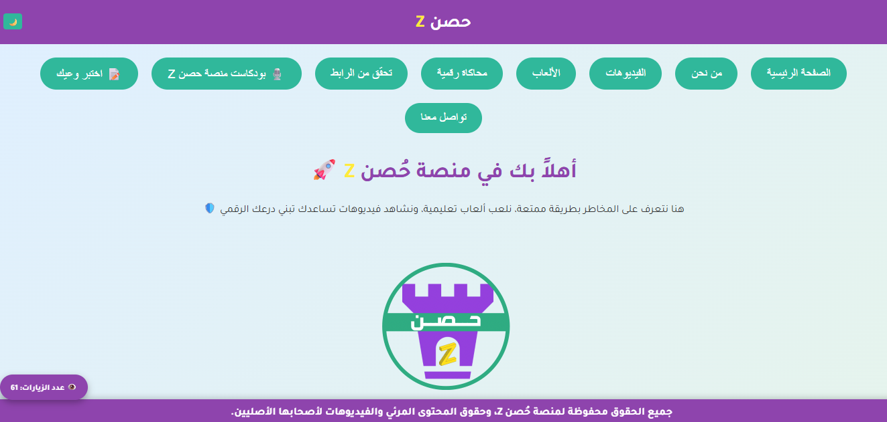
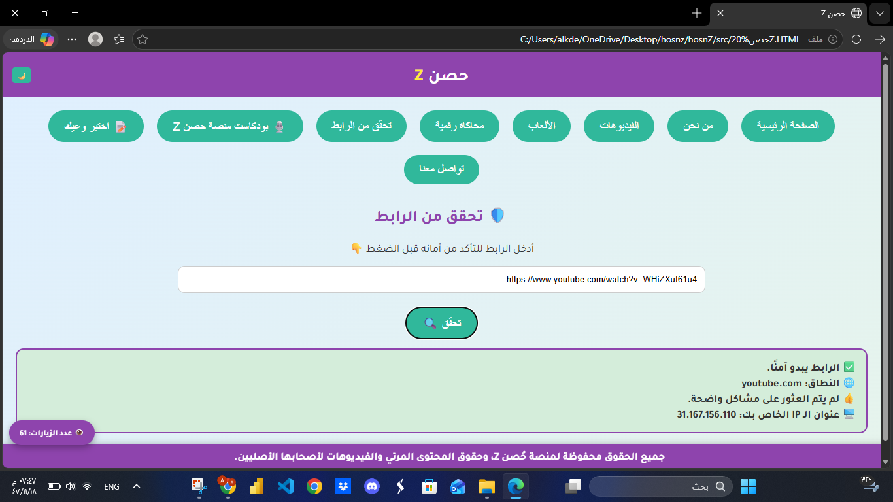

# 🛡️ Hosn Z Platform

## 📌 About the Project

**Hosn Z** is a cybersecurity-focused educational platform designed to raise awareness and provide users with essential knowledge about online safety.
The platform offers interactive learning content along with practical tools to help users detect and avoid cyber threats.

---

## 💡 Project Idea

The goal of **Hosn Z** is to create a secure and engaging environment where users can learn cybersecurity concepts in a simple and interactive way, while also having access to tools that enhance their online safety.

---

## 🚀 Features

* 🔍 Suspicious URL Verification Tool
* 🎮 Educational games for interactive learning
* 🎥 Cybersecurity awareness videos
* 📚 Structured educational content
* 🌐 Responsive and user-friendly interface

---

## 🛠️ Technologies Used

* JavaScript
* HTML5
* CSS3

---

## 📷 Preview

---

## 👩‍💻 Author

Developed as a Graduation Project.

---

## 📌 Notes

This platform aims to combine cybersecurity education with practical tools to create a safer digital experience for users.
